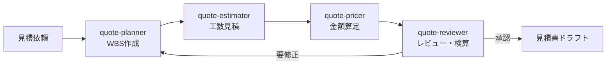

# 佐藤様グループ — AI運営ハブ

佐藤 広顕様の複数事業を、AIチームで運営するためのナレッジとルールの中心地。
動画の「会社の仕組み」（CLAUDE.md ＋ ナレッジ ＋ スキル）をグループ規模に拡張した型。

## 🗺 全体構成

| 場所 | 役割 | 動画でいうと |
|---|---|---|
| `CLAUDE.md` | グループ全体ルール（佐藤様の特性・報告の作法） | スマホ全体設定 |
| `事業マップ.md` | 光和工業・サウナ・moco・リフォームの全体像 | 会社の組織図 |
| `環境.md` | Cowork実行環境・MCP接続 | インフラ |
| `サウナ/` | KÖWA SAUNA事業（✅型を構築済み） | 1つの事業部 |
| `.claude/skills/` | 繰り返し作業のスキル（合言葉で発動） | 部署の定型業務 |

## 🚦 進捗

- ✅ **サウナ**：CLAUDE.md＋ナレッジ＋スキル＋稼働中bot まで構築済み
- 🔜 **次**：`サウナ/_要確認リスト.md` の穴埋め → 同じ型を清掃・積水・mocoへ横展開
- 詳細な展開計画：`サウナ/拡張ロードマップ.md` ／ `事業マップ.md`

## 階層の考え方

```
CLAUDE.md（グループ共通）
└─ サウナ/CLAUDE.md（事業ルール）
   └─ .claude/skills/（具体作業）
```
新しいセッションは上から順に読み込むので、グループの作法と事業のルールを
両方踏まえた状態で仕事を始められる。

## 見積チーム(Quotation Team)

Claude Code 上で動く「見積チーム」のセットアップです。見積依頼を4つの専門エージェントがパイプラインで処理し、見積書ドラフトを作成します。

### 使い方

Claude Code でこのリポジトリを開き、次のように依頼します。

```
/quote-team 会員管理機能(登録・ログイン・マイページ)を追加開発する場合の見積をお願いします。単価は9万円/人日。
```

または自然文で「見積チーム起動」と伝えても起動します。

### チーム構成

| エージェント | 役割 | 定義ファイル |
|-------------|------|-------------|
| quote-planner | 要件整理・WBS分解 | `.claude/agents/quote-planner.md` |
| quote-estimator | 工数見積(三点見積・PERT) | `.claude/agents/quote-estimator.md` |
| quote-pricer | 価格算定・見積書ドラフト作成 | `.claude/agents/quote-pricer.md` |
| quote-reviewer | 抜け漏れチェック・検算 | `.claude/agents/quote-reviewer.md` |

### 処理の流れ



オーケストレーションの詳細は `.claude/skills/quote-team/SKILL.md` を参照してください。作成した見積書は `quotes/` ディレクトリに保存されます。
※既存の光和リフォーム見積（退去・住設・単価マスター運用）は従来どおり `kowa-estimate` / `kowa-setsubi-estimate` が担当。quote-teamは開発・プロジェクト型見積のパイプライン。
