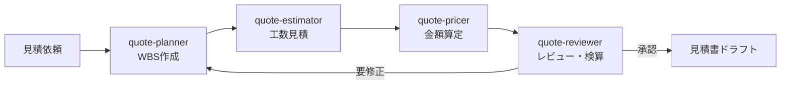

# test-repo-my-first-codex-smart-support-dev

## 見積チーム(Quotation Team)

Claude Code 上で動く「見積チーム」のセットアップです。見積依頼を4つの専門エージェントがパイプラインで処理し、見積書ドラフトを作成します。

### 使い方

Claude Code でこのリポジトリを開き、次のように依頼します。

```
/quote-team 会員管理機能(登録・ログイン・マイページ)を追加開発する場合の見積をお願いします。単価は9万円/人日。
```

または自然文で「見積チーム起動」と伝えても起動します。

### チーム構成

| エージェント | 役割 | 定義ファイル |
|-------------|------|-------------|
| quote-planner | 要件整理・WBS分解 | `.claude/agents/quote-planner.md` |
| quote-estimator | 工数見積(三点見積・PERT) | `.claude/agents/quote-estimator.md` |
| quote-pricer | 価格算定・見積書ドラフト作成 | `.claude/agents/quote-pricer.md` |
| quote-reviewer | 抜け漏れチェック・検算 | `.claude/agents/quote-reviewer.md` |

### 処理の流れ



オーケストレーションの詳細は `.claude/skills/quote-team/SKILL.md` を参照してください。作成した見積書は `quotes/` ディレクトリに保存されます。
